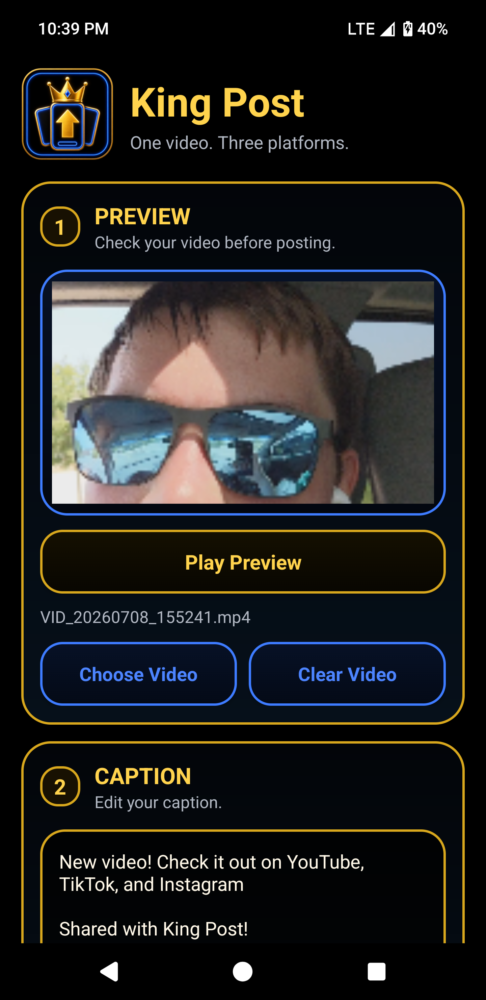
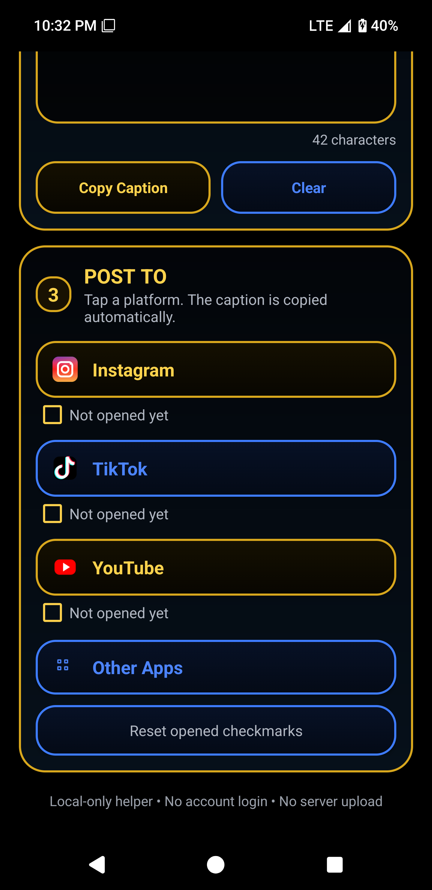
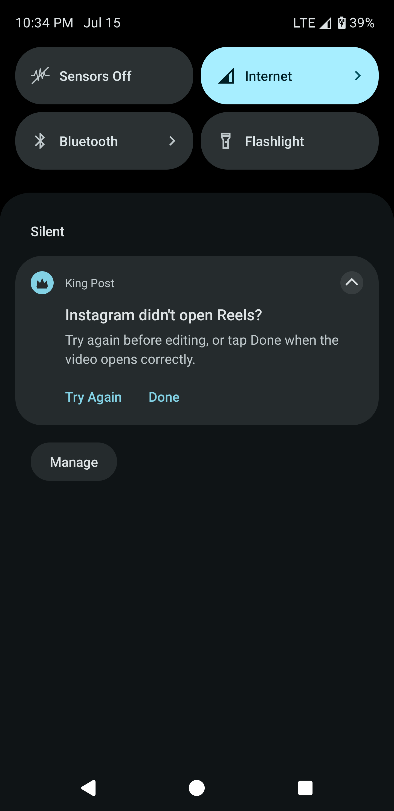
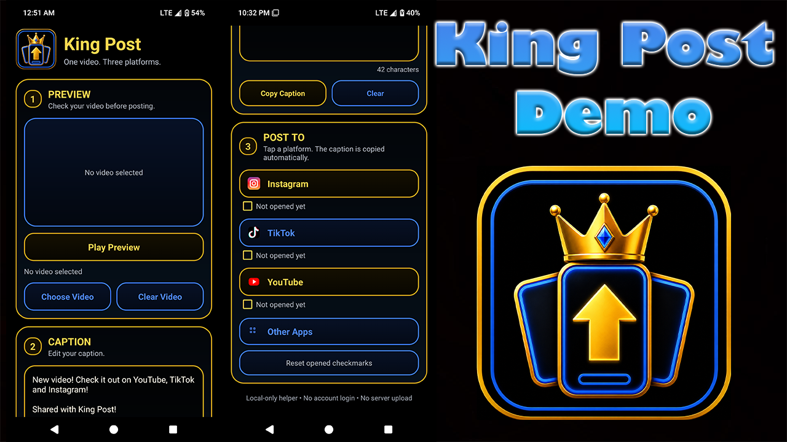

  

<h1 align="center">King Post</h1>

King Post is a lightweight, local-first Android app that helps you share videos to YouTube, TikTok, and Instagram Reels.

It uses Android's built-in sharing system to send your selected video to each platform individually, bringing you directly to the platform's editing or upload screen.

The project was developed with AI-assisted coding and packaging help, then manually tested, debugged, and polished to give it that human touch.

Feel free to test it out, play around with it, and modify it. I hope you enjoy it!

**Made by: King Alex Gilbert**

## Screenshots

### Main UI

### Posting Section

### Instagram Retry Notification

## Features

- Share one selected video to YouTube, TikTok, and Instagram
- Copy and reuse the same caption across platforms
- Preview the selected video before sharing
- Track which platform apps have already been opened
- Share to other compatible Android apps
- Local-first operation with no King Post account or server upload

## YouTube Demo

Watch the official King Post walkthrough demo:

[King Post – Android Video Sharing App Demo](https://youtube.com/shorts/wG4YU_WwDek)

## Privacy

King Post does not collect personal information, require an account, display ads, or upload videos to its own servers.

The app only accesses videos selected by the user and may temporarily prepare cached copies when required for Android sharing.

## Limitations

Because King Post is local-first and does not use the official posting APIs of these platforms, it cannot automatically publish a video on your behalf.

Instead, King Post opens each platform's editing or upload screen. You can then paste your copied caption, adjust the platform-specific settings, and publish the video yourself.

Behavior may vary depending on your device, Android version, and the installed versions of the social media apps.

### TikTok

TikTok generally handles videos shared through Android's sharing system reliably.

King Post may create a temporary cached copy of the selected video so TikTok can access it. Make sure your device has enough available storage, especially when sharing large videos.

### Instagram

Instagram's handling of videos shared through Android can be inconsistent. Depending on the device and Instagram version, it may open the Reel editor correctly or return to another part of the Instagram app.

This behavior comes from Instagram's handling of Android share requests rather than King Post's core sharing process.

After sharing, King Post displays a silent notification asking whether Instagram opened correctly:

- Select `Try Again` to reshare the video.
- Select `Done` to dismiss the notification.

### YouTube

YouTube also generally handles videos shared through Android's sharing system reliably.

King Post requires the regular YouTube app. YouTube Studio does not accept videos through Android's sharing system, so King Post cannot send videos directly to that app.

### Other Apps

King Post includes a separate button for sharing videos with apps that are not specifically listed above.

These apps have not been individually tested, so compatibility and functionality cannot be guaranteed.

## Requirements

- Android 6.0 or later
- The corresponding platform apps installed for direct sharing
- Enough available storage to prepare temporary video copies

## Downloads

Download the developer-signed Android APK from the [latest GitHub release](https://github.com/KingAlexGilbert/king-post/releases/latest) and install it on your Android device.

Depending on your device settings, you may need to allow your browser or file manager to install unknown apps.

## Build From Source

If you want to build King Post yourself:

1. Download or clone this repository.
2. Open the project in Android Studio.
3. Let Android Studio sync the Gradle project.
4. Build the APK using: `Build → Generate App Bundles or APKs → Build APK(s)`
5. The generated APK should appear in: `app/build/outputs/apk/debug/app-debug.apk`

## License

This project is released under the GNU General Public License v3.0.

Distributed modified versions must follow the terms of the GPLv3. See the `LICENSE` file for the complete license terms.

Copyright (C) 2026 King Alex Gilbert

